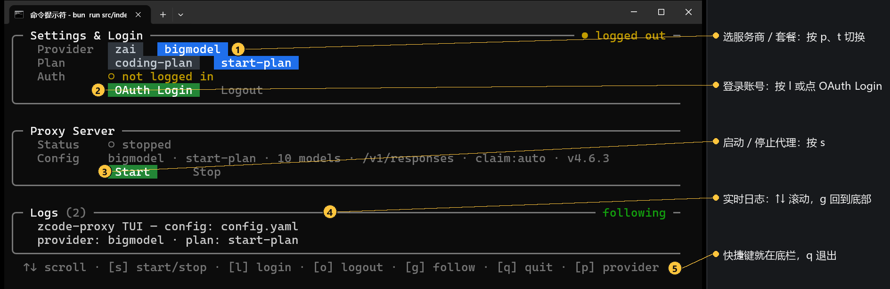
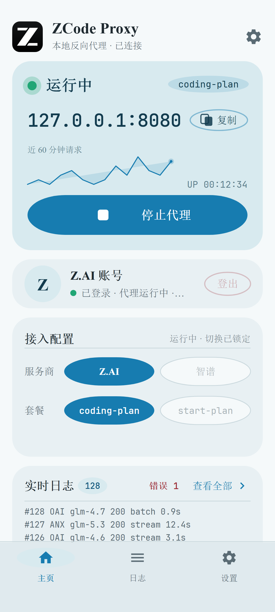
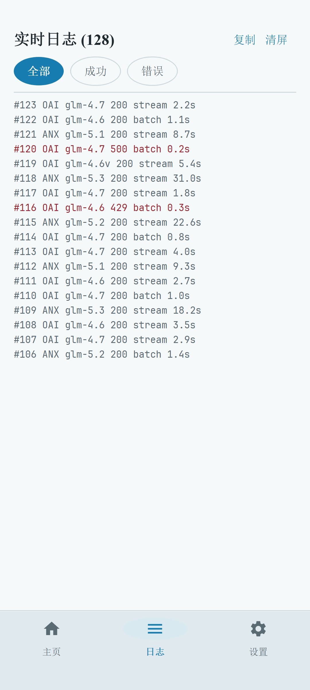
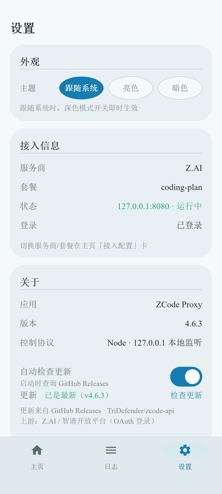
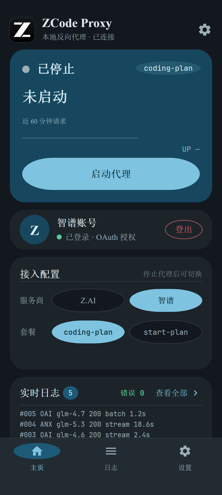

<div align="center">


# ZCode Proxy

**把你的 GLM 编码套餐，接进所有 AI 编程工具。**

一个跑在自己电脑上的小工具：智谱 Z.AI / Bigmodel 的编码套餐（个人套餐 / 体验套餐）
本来只能在官方客户端里用，ZCode Proxy 在本机把它变成标准的 OpenAI / Anthropic 接口，
于是 Claude Code、Codex、Silly Tavern ……都能直接用上你的套餐额度。

[快速上手](#-五分钟上手) · [接入编码工具](#-把编码工具接上来) · [手机版](#-手机版-android) · [常见问题](#-常见问题)

</div>

---

## 它能帮你做什么

- 🧩 **一个地址，三种格式** —— OpenAI、Anthropic、Responses（Codex 专用）接口都在本机 `127.0.0.1:8080` 上，工具认哪种就给它哪种。
- 🖥️ **带图形面板** —— 终端启动就是一块可视化面板（也可纯后台运行），启动、登录、看日志点点就行，还能用手机管理。
- 📱 **安卓 App** —— 手机上启动/停止代理、看实时日志、切换服务商，出门在外也好用。
- 💬 **自带网页聊天** —— 打开 `/webui` 就是一个本地 ChatGPT 风格聊天页，随手测试模型。
- 🌙 **闲时通道 & 套餐秒抢**（可选）—— 错峰时段的免费额度通道、限量体验套餐自动领取，都是内置功能。
- 🪟 **全平台** —— Windows / macOS / Linux 一份代码直接跑，也能编译成单文件程序或 Docker 部署。

## 🚀 一分钟上手

### 第 1 步：从[GitHub Releases](https://github.com/TriDefender/zcode-api/releases)下载最新版本的exe

没错，这就完了，就是这么简单

启动后进入终端控制面板（这就是主界面）：



面板分三块：**登录与设置**（服务商 / 套餐 / 登录）、**代理服务**（启动停止 / 当前配置）、**日志**（每个请求一行，实时滚动）。按 <kbd>s</kbd> 启动代理，看到 `Status: running` 就绪了。

> 用不惯键盘快捷键？面板上的按钮支持**鼠标点击**。想让它在后台静默运行？`bun run zcode-proxy --cli serve`。

### 面板快捷键

| 按键 | 作用 |
|------|------|
| <kbd>s</kbd> | 启动 / 停止代理 |
| <kbd>l</kbd> | 登录当前服务商（打开浏览器授权） |
| <kbd>L</kbd> | 无头服务器专用：把登录切换成"粘贴链接"模式 |
| <kbd>o</kbd> | 退出登录 |
| <kbd>p</kbd> / <kbd>t</kbd> | 切换服务商（Z.AI ↔ 智谱）/ 套餐（coding-plan ↔ start-plan） |
| <kbd>↑</kbd><kbd>↓</kbd> / <kbd>PgUp</kbd> / <kbd>g</kbd> | 滚动日志 / 回到底部 |
| <kbd>c</kbd> | 清屏日志 |
| <kbd>q</kbd> | 退出面板 |

## 🔌 把编码工具接上来

代理启动后，本机地址就是 **`http://127.0.0.1:8080`**。你的工具只需要改两样东西：**接口地址**和**模型名**。

关于「API Key」：如果你在配置里设置过 `auth.proxyApiKey`（或环境变量 `ZCODE_PROXY_API_KEY`），工具里就填同一个值；没设置的话随便填（如 `sk-1234`），本机自用不校验。

<details>
<summary><b>Claude Code</b>（点开看配置）</summary>

```bash
# macOS / Linux
export ANTHROPIC_BASE_URL=http://127.0.0.1:8080
export ANTHROPIC_AUTH_TOKEN=sk-1234
export ANTHROPIC_MODEL=glm-4.7
claude
```

```powershell
# Windows PowerShell
$env:ANTHROPIC_BASE_URL = "http://127.0.0.1:8080"
$env:ANTHROPIC_AUTH_TOKEN = "sk-1234"
$env:ANTHROPIC_MODEL = "glm-4.7"
claude
```

</details>

<details>
<summary><b>Codex CLI</b>（走 Responses 接口）</summary>

编辑 `~/.codex/config.toml`：

```toml
model_provider = "zcode"
model = "glm-5.3"

[model_providers.zcode]
name = "ZCode Proxy"
base_url = "http://127.0.0.1:8080/v1"
wire_api = "responses"
env_key = "ZCODE_API_KEY"   # 任意非空值即可，除非你设置了代理密钥
```

</details>

<details>
<summary><b>其他 OpenAI 兼容工具</b>（Cherry Studio、Kilo Code、Cline、LobeChat…）</summary>

在工具的"自定义提供商 / Custom Provider"里填：

| 设置项 | 值 |
|--------|-----|
| API 地址 (Base URL) | `http://127.0.0.1:8080/v1` |
| API Key | 你的代理密钥（没设就随便填） |
| 模型 | `glm-4.7`、`glm-5.3`、`glm-4.6v` 等，见下方模型表 |

Anthropic 格式的工具（如某些 Claude 客户端）地址填 `http://127.0.0.1:8080`，路径 `/v1/messages` 代理会自动接。

</details>

想先手动试一下？打开 **http://127.0.0.1:8080/webui** 就有自带聊天页；或者用 curl：

```bash
curl http://127.0.0.1:8080/v1/chat/completions -H "Content-Type: application/json" -d '{
  "model": "glm-5.3-flash",
  "messages": [{"role": "user", "content": "你好！"}]
}'
```

## 📱 手机版 (Android)

从 [GitHub Releases](https://github.com/TriDefender/zcode-api/releases) 下载最新的 `apk` 安装即可。
App 与电脑版功能对应：一键启动代理、扫码级简单配置、实时日志、切换服务商与套餐、亮暗双主题。

| 主页 | 日志 | 设置 | 暗色主题 |
|:-:|:-:|:-:|:-:|
|  |  |  |  |

手机和电脑跑的是同一套核心：App 内置了完整的代理引擎，**手机本身就是一个独立的代理服务器**，局域网内的电脑也可以连手机上的代理地址一起用。

<details>
<summary><b>Docker 部署</b></summary>

```bash
# 在宿主机上用固定加密种子登录（容器内无法弹浏览器时，加 --paste 粘贴登录）
ZCODE_PROXY_CREDENTIAL_SECRET="一串只有你知道的口令" \
  bun run src/index.ts auth login zai

docker run -d --name zcode-proxy -p 8080:8080 \
  -v "$(pwd)/config.yaml:/data/config.yaml:ro" \
  -v "$(HOME)/.zcode-proxy/credentials.json:/home/bun/.zcode-proxy/credentials.json:ro" \
  -e ZCODE_PROXY_CREDENTIAL_SECRET="一串只有你知道的口令" \
  ghcr.io/tridefender/zcode-proxy:latest
```

镜像多架构（amd64 / arm64），以 `bun` 用户运行。compose 写法：

```yaml
services:
  zcode-proxy:
    image: ghcr.io/tridefender/zcode-proxy:latest
    ports: ["8080:8080"]
    volumes:
      - ./config.yaml:/data/config.yaml:ro
      - ./credentials.json:/home/bun/.zcode-proxy/credentials.json:ro
    environment:
      ZCODE_PROXY_CREDENTIAL_SECRET: "一串只有你知道的口令"
    restart: unless-stopped
```

</details>

<details>
<summary><b>可调的配置与环境变量</b>（改不改都能跑）</summary>

配置文件是项目根目录的 `config.yaml`（首次启动自动生成，完整注释见 [`config.example.yaml`](config.example.yaml)），环境变量优先级更高。常用的：

| 环境变量 | 默认 | 说明 |
|----------|------|------|
| `ZCODE_PROXY_PORT` | `8080` | 监听端口 |
| `ZCODE_PROXY_API_KEY` | 无 | 客户端访问代理用的密钥（不设=不校验） |
| `ZCODE_PROVIDER` | `zai` | 服务商 `zai` / `bigmodel` |
| `ZCODE_PROXY_CONFIG` | `config.yaml` | 配置文件路径 |
| `ZCODE_PROXY_CREDENTIAL_SECRET` | 机器相关 | 登录凭据的加密种子（跨机器迁移/Docker 时需要固定它） |
| `ZCODE_LOG_FORMAT` | 桌面表格 | 设为 `compact` 可得到单行日志（适合窄屏） |

套餐类型（`plan`: `coding-plan` 个人套餐 / `start-plan` 体验套餐）在面板里按 <kbd>t</kbd> 切换，会写回 config.yaml。

</details>

<details>
<summary><b>进阶功能：闲时通道 & 套餐自动领取</b></summary>

**闲时通道 (`/async/*`)** —— 凌晨等错峰时段官方释放的免费算力通道。请求先排队领票，轮到了自动发给模型（适合不着急的批量任务）。`config.yaml` 里 `async.enabled: true` 打开；注意它一次性、不带会话记忆，多轮对话要把历史放进请求里。

**周末/体验套餐自动领取 (claim)** —— 默认开启。代理每 5 分钟探测一次官方的限量套餐活动页，上新瞬间自动帮你抢（`claim.enabled: false` 可关闭）。手动抢：`bun run src/index.ts claim`。

</details>

## 🧮 可用模型

代理会把下面这些模型挂在 `/v1/models` 上（模型列表只是展示，其他模型名也会照常转发）：

| 模型 | 上下文 | 最大输出 |
|------|--------|----------|
| `glm-4.5-air` | 131K | 96K |
| `glm-4.6` | 200K | 131K |
| `glm-4.6v`（视觉） | 131K | 32K |
| `glm-4.7` | 200K | 131K |
| `glm-5` / `glm-5-turbo` | 200K | 64K |
| `glm-5v-turbo`（视觉） | 200K | 131K |
| `glm-5.1` | 200K | 64K |
| `glm-5.2` | 1M | 128K |
| `glm-5.3` / `glm-5.3-flash` | 1M | 128K |

## ❓ 常见问题

**启动就退出，提示 Not logged in？**
先登录：`bun run src/index.ts auth login zai`（或 bigmodel）。登录一次即可，凭据加密保存。

**端口 8080 被占了？**
环境变量换一个：`ZCODE_PROXY_PORT=8081 bun run src/index.ts`，或改 `config.yaml` 的 `server.port`。

**工具一直连不上 / 401？**
如果你设置过 `ZCODE_PROXY_API_KEY`，工具里必须填同一个值；不设置则免密。注意密钥开启后**所有路由**（包括 `/health`）都要带密钥。

**换电脑 / 重装系统后要重新登录吗？**
要。凭据加密时绑定了本机信息。跨机器迁移可以两边都设 `ZCODE_PROXY_CREDENTIAL_SECRET` 为同一个值再登录/拷贝 `~/.zcode-proxy/credentials.json`。

**服务器上没有浏览器怎么登录？**
用粘贴模式：`bun run src/index.ts auth login bigmodel --paste`，把打印出来的链接在任何设备的浏览器打开，再把跳转后的完整网址粘回来即可。

**它在后台到底做了什么？**
它就是一个"翻译官 + 传话员"：把你的工具发出的标准请求翻译成官方客户端的同款请求转发上去，再把回复原样翻译回来。所有流量都只在你本机和官方服务器之间，不经过任何第三方。

## 🛠️ 参与开发

```bash
bun test            # 跑测试
bun x tsc --noEmit  # 类型检查
bun run dev         # 开发模式启动面板
```

架构与实现细节见 [`AGENTS.md`](AGENTS.md) 与各子目录的知识库文档。

## License

MIT
